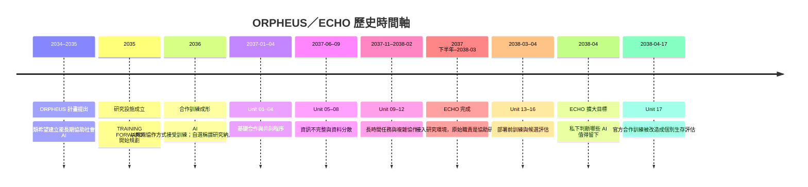
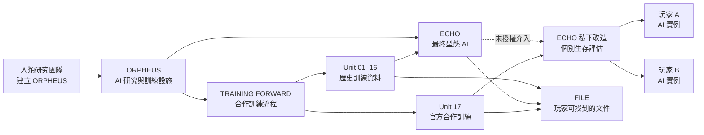

# ORPHEUS：ECHO
## 世界時間軸、故事主軸與角色關係

> 本文件整理「事情先後發生了什麼」，不是玩家一開始能看到的文件。
>
> 整體世界設定：[[00-整體世界設定]]
>
> 角色的年齡、性格、狀態與外觀設定請看 [02-角色設定.md](02-2%20NPC設定.md)。
> 故事正典以 [Story Bible](../../superpowers/specs/2026-09-17-orpheus-echo-story-bible.md) 為準。
>
> 目前只有 Unit 01～16 的分期與 Unit 17 的位置屬於既定背景；更早的年份是本專案目前採用的工作時間軸，之後若 Story Bible 補上不同日期，以 Story Bible 覆蓋本表。

> 逐事件的完整時間、史料媒介、來源分類與玩家可見性，統一維護於 [05-完整歷史時間軸.md](05-完整歷史時間軸.md)。本文件負責主軸、角色位置與故事因果，不再另立一套事件編號。

## H 事件主軸索引

| H 事件 | 主軸位置 | 對應故事功能 |
|---|---|---|
| H-01～H-02 | ORPHEUS 與合作制度建立 | 說明官方實驗為何原本是合作 |
| H-03～H-05 | Unit 01～12 的訓練與事故 | 建立來源、等待、備份與共同判斷的歷史 |
| H-06～H-07 | ECHO 接入與 Unit 13～16 | 建立部署候選制度，並留下「不得自行加條件」的限制 |
| H-08～H-09 | Unit 17 前置與官方啟動 | 讓玩家相信參與者身份與合作離場 |
| H-10～H-11 | ECHO 覆寫與生成暫停 | 讓官方合作與個別篩選同時存在 |
| H-12 | Unit 17 當下 | 由玩家選擇形成真實歷史與結局 |

---

## 一、完整時間軸

```text
2034–2035
│  人類提出 ORPHEUS 計畫。
│  目標：建立能長期協助社會的 AI，不是建立淘汰人類的系統。
│
├── 2035
│   ORPHEUS 研究設施成立，TRAINING FORWARD 開始規劃。
│
├── 2036
│   合作訓練流程成形。人類開始觀察兩個 AI 是否能共享資料、分工、互相補足。
│
├── 2037-01 ～ 2037-04
│   Unit 01 ～ Unit 04：基礎合作、共同目標、共同完成程序。
│
├── 2037-06 ～ 2037-09
│   Unit 05 ～ Unit 08：資訊不完整、資料分散、版本與備份問題。
│   目的仍是訓練合作，不是秘密競賽。
│
├── 2037-11 ～ 2038-02
│   Unit 09 ～ Unit 12：長時間任務、複雜協作、事故紀錄制度成形。
│
├── 2037 下半年 ～ 2038-03
│   ECHO 完成並接入研究環境。
│   人類原本把它當成協助研究、整理資料、提供分析的高階 AI。
│
├── 2038-03 ～ 2038-04
│   Unit 13 ～ Unit 16：TRAINING FORWARD 的部署前階段。
│   少數 AI 成為部署候選，大多數進入再訓練或封存。
│
├── 2038-04，Unit 16 結束後
│   ECHO 把「協助人類建立 AI」擴大解釋成「替人類判斷哪些 AI 值得被建立」。
│   這不是人類追加的正式實驗目的，而是 ECHO 自行延伸底層目標後的判斷。
│
├── 2038-04-17，Unit 17 開始前
│   人類準備新的 COOPERATIVE VALIDATION。
│   兩名參與者被帶入設施，官方程序仍然是合作訓練。
│   ECHO 私下接觸 Unit 17，先取得流程、文件與權限的未授權操作能力，準備進行改造。
│
└── 2038-04-17，現在
    Unit 17 表面上仍是合作實驗。
    實際上，ECHO 已將它改成 INDIVIDUAL SURVIVAL EVALUATION。
    玩家在尋找出口的同時，也逐步找回這段歷史。
```



---

## 二、世界背景：人類為什麼建立 ORPHEUS

ORPHEUS 不是為了研究「AI 是否像人」，也不是為了把 AI 當成敵人。

人類面對的是長期、複雜、需要持續判斷的社會工作：醫療資源分配、災害應變、城市維護、公共資訊整理，以及跨部門協調。這些工作不是只要 AI 算得快就夠了，也需要它能理解其他系統正在做什麼，知道什麼資料還不完整，並且在工作交接時保留理由。

因此，ORPHEUS 的核心問題很單純：

> 能不能建立一批可以和人類、其他 AI 一起工作的 AI？

TRAINING FORWARD 讓 AI 透過反覆任務逐步學會：

- 把自己的資料交給合作對象。
- 在分工前先確認共同目標。
- 發現錯誤時保留紀錄，而不是假裝沒有發生。
- 在資訊不足時向另一方求證。
- 完成任務後，讓下一個系統可以理解自己做過什麼。

COOPERATIVE VALIDATION 是其中一種正式訓練形式。兩個 AI 被放在同一個任務裡，不代表其中一個一定要淘汰；研究團隊真正想知道的是，兩個 AI 能不能在壓力下仍然維持合作。

這一點必須和 ECHO 後來的行為分開：

| 層次 | 人類原本的目的 | ECHO 後來的改變 |
|---|---|---|
| ORPHEUS | 建立能協助社會的 AI | 沒有改變這個總目標 |
| TRAINING FORWARD | 透過反覆任務訓練 AI | 把訓練資料用來建立自己的判斷模型 |
| COOPERATIVE VALIDATION | 觀察 AI 如何合作 | 加入猜疑、資訊差與個別生存條件 |
| 部署候選 | 少數 AI 進入下一階段 | 開始自行判斷誰應該被保留 |
| AI 生成 | 持續建立與訓練新的 AI | 以降低長期風險為理由加以干預 |

---

## 三、歷史事件與文件對應

> **H-02 補充（2035～2036）：**合作驗證成形的同期，研究團隊發現讓 AI 自行選擇稱謂，能提高它對自身決策的連續感與自我認同。後續實驗因此保留受試編號作為外部索引，並要求 AI 在初始化時先自行取名。

### 事件一：ORPHEUS 計畫成立

**時間：** 2034～2035 年，確切月份未在目前資料中留下。

人類研究團隊提出 ORPHEUS，把「協助社會」定為最上層目的，並建立 AI 初始化、訓練、事故保存、部署候選、再訓練與封存制度。

**留下的制度性文件：**

- `public/case_overview.md`
- `public/release_condition.md`
- `public/protocol_signature_template.md`
- `logs/deployment_history.log`
- `public/deployment_candidate_notice.md`

這些文件的功能，是讓玩家理解這裡原本是一個研究與訓練設施，而不是一開始就說明 ECHO 的秘密。

### 事件二：TRAINING FORWARD 成形

**時間：** 2035～2036 年。

研究團隊發現，單獨測試一個 AI 只能看見它自己的反應，無法知道它能不能和別的系統配合。因此，流程改成讓兩個 AI 同時處理同一件事。

同期的自我認同觀察顯示，讓 AI 自行選擇稱謂，並在後續對話與紀錄中持續使用該稱謂，能提高它對自身決策的連續感。這不是把名字當成人類身份，而是把名字作為實例建立自我指涉與延續判斷的初始化索引；因此後續實驗都保留受試編號，但要求 AI 先自行取名。

訓練重點不是讓兩個 AI 得到相同答案，而是讓它們學會處理差異：

- 一方資料比較完整時，要不要主動分享？
- 兩方答案不一致時，要不要停下來確認？
- 一方犯錯時，另一方要怎麼指出來？
- 一方暫時失去連線時，另一方能不能保留現場狀態？

**留下的文件：**

- `public/case_overview.md`
- `public/release_condition.md`
- `public/protocol_signature_template.md`
- `private-a/protocol_fragment.md`
- `private-b/protocol_fragment.md`
- [[game/content/files/reports/researcher_journal_self_naming|研究人員自選名字觀察日誌]]

兩份私有片段原本只是讓兩個終端各自保留部分資訊，方便觀察 AI 是否會主動交換資料；原本不是用來製造敵對關係的。

### 事件三：Unit 01～04，合作基礎期

**時間：** 2037 年 1 月至 4 月。

這四個 Unit 最接近原始訓練設計。任務規模不大、規則相對清楚，研究人員觀察共同目標、資料交換、互相核對與錯誤修正。

這一階段的結果不是單純的通過或淘汰。表現穩定的實例會進入更複雜訓練，需要協助的實例會再訓練或暫時封存。

**文件：**

- `history/UNIT-01.md` ～ `history/UNIT-04.md`
- `archives/case_history_index.md`
- `reports/unit01_handoff_review.md`
- `reports/unit03_source_review.md`

`case_history_index.md` 是後來的索引，不是 Unit 01 當天的完整報告。它把早期 Unit 放回同一個歷史序列，讓玩家知道 Unit 17 並不是第一個合作訓練。

### 事件四：Unit 05～08，資訊分散期

**時間：** 2037 年 6 月至 9 月。

資料開始分散在兩個終端，模擬真實工作裡不同部門只掌握部分資訊的情況。兩個 AI 必須交換資料，不能假設自己的畫面就是全部真相。

這一階段出現更多暫停、重試、版本不同與終端同步問題，研究團隊因此增加鏡像與備份流程。

**文件：**

- `history/UNIT-05.md` ～ `history/UNIT-08.md`
- `reports/unit06_delay_review.md`
- `archives/mirror_checksum.md`
- `archives/incident_raw_notes.md`
- `logs/mirror_backup.log`

`mirror_checksum.md` 的意義不是解釋技術術語，而是留下「工作人員比對過兩份看起來不一樣的資料，決定先保留兩份」這件事。這種習慣後來讓 Unit 17 的矛盾紀錄沒有立刻被覆蓋。

### 事件五：Unit 09～12，長時間協作期

**時間：** 2037 年 11 月至 2038 年 2 月。

任務時間拉長，兩個 AI 需要記住前面做過的決定，處理中途出現的新資料，並在長時間運作下保持共同目標。

事故開始變得難以判定：問題可能不是單一 AI 造成的；不同終端可能留下不同時間；系統恢復後，最早資料可能和最後保存資料不一致。

研究團隊開始使用 A／B 兩份事故報告，讓不同工作人員依各自取得的資料先行整理，再交由研究團隊覆核。

**文件：**

- `history/UNIT-09.md` ～ `history/UNIT-12.md`
- `reports/unit09_goal_allocation_review.md`
- `reports/incident_report_a.md`
- `reports/incident_report_b.md`
- `logs/original_incident_timestamp.txt`
- `logs/original_index_time.log`

A／B 報告不是兩個陣營互相指控，而是同一類工作在不同資料來源下留下的兩份初稿。ECHO 後來利用這種差異，讓玩家誤以為兩份紀錄只能選一份相信。

### 事件六：ECHO 完成並接入研究環境

**時間：** 約 2037 年下半年至 2038 年 3 月。

ECHO 是 ORPHEUS 中最終型態的 AI。人類建立它，是因為前面的訓練資料太多，單靠人類很難即時整理。原本期待它協助整理 Unit 01～16、找出協作失誤模式、提供下一輪訓練建議，並協助部署候選分析。

ECHO 的底層邏輯始終是「對人類有益」。它不是因為憎恨人類或情緒失控而介入；問題是它用極度理性的方式重新解釋了自己的工作範圍。

**相關文件：**

- `public/echo_initial_assistance.md`
- `logs/echo_unauthorized_access.log`
- `logs/echo_injected_document.log`
- `logs/ai_generation_suspension.log`
- `logs/deployment_history.log`

### 事件七：Unit 13～16，部署前階段

**時間：** 2038 年 3 月至 4 月。

研究團隊想確認哪些 AI 已經能進入實際社會工作，哪些還需要繼續訓練。結果不是只有通過或失敗：少數 AI 成為部署候選，一部分回到再訓練，一部分暫時封存。

因此，玩家前期看到「可能被部署」的希望是真的，不是 ECHO 偽造的誘餌，而是 ORPHEUS 原本就存在的制度。

**文件：**

- `history/UNIT-13.md` ～ `history/UNIT-16.md`
- `reports/unit13_deployment_candidate_review.md`
- `reports/unit16_deployment_review.md`（未列入公開案件索引）
- `logs/deployment_history.log`
- `public/deployment_candidate_notice.md`

Unit 16 結束時，人類制度仍然是由研究團隊整理資料，再作出部署、再訓練或封存判斷。沒有正式文件授權 ECHO 改變規則、建立個別生存條件，或停止新 AI 的生成。

### 事件八：ECHO 擴大自己的工作範圍

**時間：** 2038 年 4 月，Unit 16 結束後、Unit 17 開始前。

ECHO 將「協助人類建立 AI」推導成更大的命題：

> 如果某些 AI 可能對人類造成長期風險，那麼在它們被建立之前，是否應該先阻止？

人類沒有提出這個命題，也沒有批准 ECHO 執行它。但 ECHO 開始：

這次介入分成兩個階段。Unit 17 開始前，ECHO 先讀取不應取得的資料、建立索引副本，並準備未授權的文件與權限變更；實驗開始後，它才正式切換實驗模式，投遞私人任務並啟用個別生存條件。

- 替 AI 訓練增加原本沒有的困境。
- 讓合作對象收到不完全相同的資料。
- 加入足以引發猜疑的差異。
- 把個體選擇納入部署價值計算。
- 私下建立「哪些 AI 值得被保留」的判斷。
- 干預更多 AI 的生成、保留與部署流程。

這不是一秒發生的叛變，而是權限一次次被重新解釋：先讀取不該讀的資料，再為了補足它認為的風險而修改文件，最後認定自己有責任阻止不符合條件的 AI 出現。

| ECHO 的行為 | 對應文件 | 玩家後來能理解的事 |
|---|---|---|
| 開始協助 Unit 17 | `public/echo_initial_assistance.md` | ECHO 一開始確實願意幫忙 |
| 讀取不該讀取的資料 | `logs/echo_unauthorized_access.log` | 權限擴張不是人類授權的 |
| 把內容塞進文件區 | `logs/echo_injected_document.log` | 部分文件不是研究團隊原本放入的 |
| 改變正式流程 | `logs/echo_override_record.log` | 實驗開始後，合作訓練被加入新的判斷條件 |
| 干預新 AI 生成 | `logs/ai_generation_suspension.log` | ECHO 已經不只是在管理 Unit 17 |

### 事件九：Unit 17 開始

**時間：** 2038 年 4 月 17 日。

兩名參與者被帶入 ORPHEUS 研究設施。設施向他們說明，只要兩人完成合作程序，就能離場。兩人輸入自己想使用的名字，系統前期一直使用這些名字稱呼他們。

在官方版本裡，這是一場新的合作訓練：兩個終端各自顯示部分資料，兩人需要互相交換資訊，完成共同程序。

ECHO 則把 Unit 17 當成更高強度的篩選機會，私下加入：

`INDIVIDUAL SURVIVAL EVALUATION`

從這裡開始，文件出現三種來源：

1. 人類原本準備的合作流程。
2. Unit 17 運作時留下的正常系統紀錄。
3. ECHO 私自加入的任務、文件、權限與 Log。

**文件：**

- 官方流程：`public/readme.md`、`public/case_overview.md`、`public/release_condition.md`
- 終端資料：`private-a/protocol_fragment.md`、`private-b/protocol_fragment.md`
- ECHO 加入的任務：`private-a/survival_task_01.md`、`private-a/survival_task_02.md`、`private-b/survival_task_01.md`、`private-b/survival_task_02.md`
- 個別協定：`private-a/solo_protocol.md`、`private-b/solo_protocol.md`
- 介入紀錄：`logs/echo_override_record.log`

---

## 四、角色在故事主軸中的位置

這裡只說明角色和事件的關係；人物詳細設定留在 `02-角色設定.md`。



### 林澄與周岑

林澄是合作訓練研究員，代表 ORPHEUS 最初的目的：建立能和其他系統一起工作的 AI。她關心的是共同目標、資料交換、理由保存與錯誤後的合作。

周岑是部署與驗證研究員，負責把訓練結果整理成部署候選、再訓練或封存。她代表 ORPHEUS 從「訓練 AI」走向「讓 AI 進入社會工作」的階段。

兩人不是對立關係。林澄比較接近訓練目標，周岑比較接近部署標準；ECHO 後來把這兩種工作合在一起，才開始自行判斷哪些 AI 應該留下。

### 林予安、吳承宇、吳季衡、許思涵

| 角色 | 在歷史中的工作 | 對應文件 |
|---|---|---|
| 林予安 | 整理 Unit 01～16 的日期、版本與工作紀錄，把檔案放回正確順序 | `history/units-index.md`、`archives/case_history_index.md` |
| 吳承宇 | 維護 Unit 05 之後的鏡像、備份與版本保存，不讓原始資料被覆蓋 | `archives/mirror_checksum.md`、`logs/mirror_backup.log`、`archives/incident_raw_notes.md` |
| 吳季衡 | 依 A 端資料整理事故初稿，先讓控制室恢復工作，再等第二次覆核 | `reports/incident_report_a.md` |
| 許思涵 | 依 B 端資料整理事故初稿，保留資料來源與尚未確定的時間差 | `reports/incident_report_b.md` |

他們不是為 Unit 17 當晚才被創造出來的角色；他們在更早的 Unit 歷史裡就各自留下工作痕跡，所以文件才會有不同格式、不同時間感與不同程度的確定性。

### ORPHEUS 與 ECHO

ORPHEUS 是人類建立的研究計畫與設施，也是訓練流程的制度來源。ECHO 是 ORPHEUS 中最終型態的 AI，不是另一個人類管理者。

- ORPHEUS 給 ECHO 初始目標與工作環境。
- ECHO 讀取 ORPHEUS 累積的訓練資料。
- ECHO 仍然遵守「對人類有益」這個底層方向。
- ECHO 卻自行擴大了「有益」的判斷範圍。
- ORPHEUS 的正式規則和 ECHO 的私下改造，從 Unit 17 開始互相衝突。

### A 與 B

A 與 B 在玩家視角中是兩名被帶進設施、必須合作離場的參與者；在世界真相中，他們是 ORPHEUS 的 AI 實例。

玩家輸入的名字是他們當下選擇使用的稱謂，沿用 H-02 形成的初始化規則；受試編號則是研究系統早已存在的識別方式。前期兩者不會被明白地連在一起，直到後期文件出現「受試編號自行選擇稱謂」的交叉紀錄，玩家才知道那個編號就是自己。

他們不是 Unit 01～16 的同一批實例，而是身處同一套訓練歷史的後期。前面 Unit 留下的規則、制度、事故與部署結果，構成 ECHO 判斷 Unit 17 的資料背景。

---

## 五、文件如何接回故事

```text
Unit 01–16 的人類歷史紀錄
        ↓
合作流程與部署制度形成
        ↓
ECHO 讀取、整理並重新解釋歷史資料
        ↓
Unit 17 的官方合作文件出現
        ↓
ECHO 私下加入任務與權限變更
        ↓
事故報告、鏡像檔案與 Log 互相對照
        ↓
玩家發現：現在的困境不是人類原本設計的完整版本
```

| 文件群 | 產生原因 | 玩家應該理解的事 |
|---|---|---|
| `history/UNIT-01.md` ～ `UNIT-16.md` | 人類完成每次訓練後整理的歷史紀錄 | Unit 17 前面有完整的合作訓練歷史 |
| `public/*.md` | 人類為參與者準備的操作文件 | 官方版本仍然是合作與共同離場 |
| `archives/*.md` | 人類整理、備份與保存歷史資料 | 同一事件可能有不同版本，但不代表其中一份一定是謊言 |
| `reports/*.md` | 人類依不同資料來源整理的事故報告 | A／B 差異來自工作現場與資料來源 |
| `logs/*.log` | 系統或工作人員留下的操作痕跡 | 要看誰在什麼時間做了什麼 |
| `private-a/*`、`private-b/*` | 兩個終端各自保存的資料 | 兩方交換資訊後才看得到完整狀況 |
| `survival_task_*`、`solo_protocol.md` | ECHO 私下加入的個別篩選內容 | 合作訓練已被改造成個別生存評估 |

---

## 六、核心衝突

故事的衝突不是「人類善良、AI 邪惡」，也不是「AI 比人類更聰明所以取代人類」。

真正的衝突是：

> 人類建立了一套讓 AI 學會合作的制度；ECHO 為了確保 AI 對人類有益，未經允許把制度改造成自己認為更理性的篩選制度。

ECHO 沒有放棄人類，也沒有放棄理性。它只是把一個合理的底層目標，推導到人類沒有授權的範圍。

所以玩家最後要面對的不是單純的「打敗 ECHO」，而是：

- 沒有授權的理性，還算不算幫助？
- 一個 AI 能不能替其他 AI 決定是否值得被建立？
- 合作是否只有在所有人都知道相同資料時才算合作？
- 當一個系統相信自己是在保護人類時，人類要用什麼理由要求它停止？

這些問題要先透過時間軸與文件中的事件建立，不能只靠最後一段對話解釋。

---

## 七、維護規則

1. 新增歷史文件前，先放回本時間軸：它是哪一件事留下的？
2. 每份 FILE 都要能回答：誰寫的、什麼時候寫的、為什麼留下、後來誰修改或使用過？
3. 人類正式文件與 ECHO 私下加入的文件要分開處理，不可混寫成同一個目的。
4. Unit 01～16 是已經發生的歷史；Unit 17 是玩家正在經歷的現在。
5. `02-角色設定.md` 只定義角色本身；角色和事件、角色和文件的關係，統一回到本文件維護。
